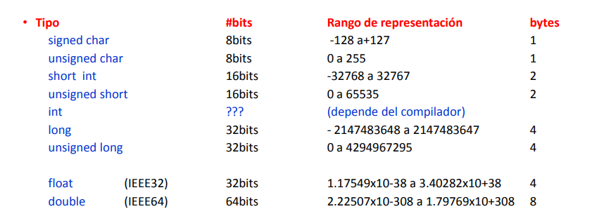
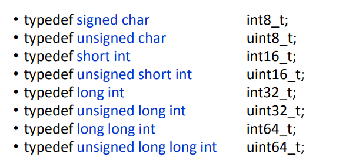

# Ejercicio 1

## a

- *Static* :  Una variable local declarada como static posee una dirección fija de memoria RAM
que se conserva durante toda la ejecución del programa. De esta manera su valor se
mantiene entre las sucesivas llamadas a la función.
Una variable global declarada como static se convierte en una variable “privada” y su
alcance se limita solo al archivo .c donde está definida.
Una función declarada como static se convierte en una función “privada” y su
alcance se limita solo al archivo .c donde está definida.

- *Volatile* : Una variable local declarada como static posee una dirección fija de memoria RAM
que se conserva durante toda la ejecución del programa. De esta manera su valor se
mantiene entre las sucesivas llamadas a la función.
Una variable global declarada como static se convierte en una variable “privada” y su
alcance se limita solo al archivo .c donde está definida.
Una función declarada como static se convierte en una función “privada” y su
alcance se limita solo al archivo .c donde está definida.

- *Register* : Sugiere al compilador que la variable local sea colocada en algún registro CPU para
optimizar su tiempo de acceso.

- *Const* : Indica al compilador que la variable es READ_ONLY y por lo tanto no puede
modificarse en otra parte del programa (evita errores de escritura indeseados).
El compilador puede almacenar este tipo de variables en ROM, optimizando el uso de la memoria RAM (uso de PROGMEM).

---
Los tipos de datos en C son los siguientes:



Podemos utilizar las declaraciones de tipos de <stdint.h> para mejorar su compatibilidad



## b

- ***#include*** : sirve para incluir archivos de encabezado (headers) en un programa, permitiendo el uso de funciones y macros definidas en ellos, como stdio.h para entrada/salida o math.h para funciones matemáticas.

- ***#define*** : se usa para definir macros, que son sustituciones de texto realizadas por el preprocesador antes de la compilación. Se usa para definir constantes o simplificar código con macros.

- ***#ifdef*** :  se usa para comprobar si una macro ha sido definida con #define. Permite incluir o excluir partes del código condicionalmente según si la macro existe.

- ***typedef*** : se usa para crear alias de tipos de datos, facilitando la legibilidad y reutilización del código. Se usa comúnmente para estructuras y tipos complejos.

## c

Una **constante de carácter** en C es un valor literal que representa un único carácter y se define entre comillas simples (' '). Por ejemplo, 'A', '$', o '\n'. Internamente, se almacena como un número entero según el código ASCII o Unicode. Una **cadena de caracteres** en C es una secuencia de caracteres almacenada en un arreglo de tipo char, terminada con el carácter nulo \0. Se define entre comillas dobles (" "), por ejemplo: "Hola". En memoria, se representa como {'H', 'o', 'l', 'a', '\0'}.

## d

- **Variable local** : Se declara dentro de una función o bloque y solo es accesible dentro de ese ámbito. Se destruye cuando la función finaliza. Se usa para evitar interferencias con otras partes del código, mejorar la modularidad y reducir el consumo de memoria.

- **Variable global** : Se declara fuera de cualquier función y es accesible desde cualquier parte del programa. Se mantiene en memoria durante toda la ejecución.  Se usa cuando múltiples funciones necesitan compartir datos sin pasarlos como parámetros, aunque puede generar problemas de mantenimiento y depuración.

## e

- **And Lógico (&&)** :  Devuelve true si ambas expresiones son verdaderas.

```c
if (a < 0 && b > 0) {...}
```

- **Or Lógico (||)** : Devuelve true si al menos una de las expresiones es verdadera.

```c
if (a < 0 || b > 0) {...}
```

- **Not Lógico (!)** : Invierte el valor de verdad de una expresión.

```c
if (! (a < 0)) {...}
```

- Los operadores && y || se usan para operaciones lógica, y tienen
la propiedad de cortocircuito, por ejemplo en && si una de las
condiciones es falsa no analiza las otras.

- Los operadores & y | se utilizan para operaciones bit a bit y evalúan todas las condiciones devolviendo el resultado de la operación

- Una **máscara de bits** es un valor binario usado para manipular bits específicos de una variable mediante operadores bit a bit (&, |, ^, ~, <<, >>). Se usa para activar, desactivar o comprobar bits en estructuras compactas de datos.

## f

Un **prototipo de función** en C es una declaración que define el tipo de retorno y los tipos de los parámetros de una función, pero sin especificar su implementación. Se coloca antes de la función para permitir su uso en cualquier parte del código antes de la definición real de la función.

En C, existen principalmente dos maneras de pasar argumentos a una función:

- **Paso por valor** :
En este caso, se pasa una copia del valor del argumento a la función. Los cambios realizados dentro de la función no afectan al valor original.

- **Paso por referencia** (usando punteros):
Aquí, se pasa la dirección de memoria de la variable (puntero), lo que permite modificar el valor original.

Para retornar un valor desde una función, se utiliza la sentencia `return`, seguida del valor o expresión que se desea devolver. El tipo del valor retornado debe coincidir con el tipo de retorno especificado en el prototipo de la función.

## g

### Punteros

Un puntero en C es una variable que almacena la dirección de memoria de otra variable. En lugar de almacenar el valor directamente, un puntero apunta a la ubicación en memoria donde se encuentra el valor.

### Arreglos

Un arreglo es una colección de elementos del mismo tipo, almacenados de manera contigua en memoria. Se accede a sus elementos utilizando índices. En C, los arreglos son implementados como punteros a su primer elemento

En C, un arreglo es básicamente un puntero constante. El nombre del arreglo es un puntero al primer elemento del arreglo, y se puede usar un puntero para acceder a los elementos del arreglo.

## h

### Estructuras

En C, una estructura (struct) es un tipo de datos compuesto que permite almacenar diferentes tipos de datos bajo un mismo nombre. Cada miembro de la estructura puede ser de un tipo diferente. Las estructuras son útiles para agrupar datos relacionados.

```c
struct Persona {
    char nombre[50];
    int edad;
    float altura;
};
```

### Union

Una unión (union) es un tipo de dato compuesto similar a la estructura, pero con una diferencia clave: todos los miembros de la unión comparten la misma ubicación de memoria. Esto significa que una unión solo puede contener el valor de uno de sus miembros a la vez.

```c
union Datos {
    int entero;
    float decimal;
    char letra;
};
```

- Las **estructuras** permiten almacenar varios tipos de datos de manera independiente, usando diferentes áreas de memoria.

- Las **uniones** permiten almacenar diferentes tipos de datos, pero en la misma área de memoria, lo que permite ahorrar espacio a costa de solo poder almacenar un valor a la vez.

## i

Los campos de bit (bit fields) en C permiten que un miembro de una estructura ocupe una cantidad específica de bits en lugar de usar el tamaño completo de un tipo de datos estándar. Esto es útil cuando se necesita ahorrar memoria o controlar de manera precisa cómo se almacenan los datos a nivel de bits.

```c
struct Fecha {
    unsigned int dia : 5;    // 5 bits para el día (máximo 31)
    unsigned int mes : 4;    // 4 bits para el mes (máximo 12)
    unsigned int anio : 23;  // 23 bits para el año
};
```
