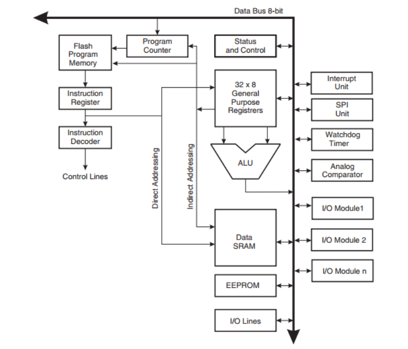

# Ejercicio 2

## a

Los microcontroladores de la familia Atmega AVR, desarrollados por Atmel (ahora parte de Microchip Technology), son ampliamente utilizados en sistemas embebidos debido a su equilibrio entre rendimiento y consumo energético.

---

### Características de algunos modelos destacados

### ATmega328P

- **Memoria Flash:** 32 KB  
- **SRAM:** 2 KB  
- **EEPROM:** 1 KB  
- **Pines de Entrada/Salida:** 23  
- **Canales ADC:** 8  
- **PWM:** 6  
- **UART:** 1  
- **SPI:** Sí  
- **I²C:** Sí  

### ATmega2560

- **Memoria Flash:** 256 KB  
- **SRAM:** 8 KB  
- **EEPROM:** 4 KB  
- **Pines de Entrada/Salida:** 86  
- **Canales ADC:** 16  
- **PWM:** 15  
- **UART:** 4  
- **SPI:** Sí  
- **I²C:** Sí  

### ATmega32U4

- **Memoria Flash:** 32 KB  
- **SRAM:** 2.5 KB  
- **EEPROM:** 1 KB  
- **Pines de Entrada/Salida:** 26  
- **Canales ADC:** 12  
- **PWM:** 7  
- **UART:** 1  
- **SPI:** Sí  
- **I²C:** Sí  

### ATmega1284P

- **Memoria Flash:** 128 KB  
- **SRAM:** 16 KB  
- **EEPROM:** 4 KB  
- **Pines de Entrada/Salida:** 32  
- **Canales ADC:** 8  
- **PWM:** 6  
- **UART:** 2  
- **SPI:** Sí  
- **I²C:** Sí  

---

### ATmega328P y ATmega2560 en las plataformas Arduino UNO y MEGA

El **Arduino UNO** utiliza el microcontrolador ATmega328P, mientras que el **Arduino MEGA 2560** está basado en el ATmega2560. A continuación, se detallan sus especificaciones:

### Arduino UNO (ATmega328P)

- **Memoria Flash:** 32 KB (0.5 KB para bootloader)  
- **SRAM:** 2 KB  
- **EEPROM:** 1 KB  
- **Pines digitales de E/S:** 14 (6 con PWM)  
- **Entradas analógicas:** 6  
- **Puertos UART:** 1  
- **Velocidad de reloj:** 16 MHz  
- **Voltaje de operación:** 5V  
- **Voltaje de entrada recomendado:** 7-12V  
- **Corriente máxima por pin de E/S:** 20 mA  

### Arduino MEGA 2560 (ATmega2560)

- **Memoria Flash:** 256 KB (8 KB para bootloader)  
- **SRAM:** 8 KB  
- **EEPROM:** 4 KB  
- **Pines digitales de E/S:** 54 (15 con PWM)  
- **Entradas analógicas:** 16  
- **Puertos UART:** 4  
- **Velocidad de reloj:** 16 MHz  
- **Voltaje de operación:** 5V  
- **Voltaje de entrada recomendado:** 7-12V  
- **Corriente máxima por pin de E/S:** 20 mA  

---

### Consideraciones adicionales

- **Memoria:** El Arduino MEGA 2560 ofrece una capacidad de memoria significativamente mayor en comparación con el UNO, lo que permite manejar programas más extensos y complejos.  
- **Pines de E/S:** La mayor cantidad de pines en el MEGA 2560 facilita la conexión de múltiples periféricos y dispositivos simultáneamente.  
- **Puertos de comunicación:** El MEGA 2560 dispone de más puertos UART, lo que es ventajoso para proyectos que requieren múltiples conexiones seriales.  

## b

### Arquitectura de la CPU

La CPU AVR se basa en una arquitectura Harvard modificada, lo que significa que posee memorias y buses separados para instrucciones y datos. Esta separación permite que, mientras una instrucción se está ejecutando, la siguiente pueda ser prefetchada desde la memoria de programa, optimizando así la eficiencia del procesamiento.

El núcleo de la CPU cuenta con 32 registros de propósito general de 8 bits (R0 a R31), donde seis de ellos (R26 a R31) pueden funcionar como tres registros de 16 bits (X, Y, Z) para direccionamiento indirecto. Además, la Unidad Aritmético-Lógica (ALU) realiza operaciones aritméticas y lógicas en un solo ciclo de reloj, interactuando directamente con los registros de propósito general.

### Modelo de Programación

El modelo de programación de AVR se caracteriza por su simplicidad y eficiencia:

Registros de Propósito General: 32 registros de 8 bits que permiten operaciones rápidas y flexibles.

Registro de Estado (SREG): Contiene indicadores que reflejan el resultado de las operaciones realizadas por la ALU, como banderas de cero, acarreo, negativo, entre otras.

Puntero de Pila (SP): Gestiona la pila utilizada para almacenar datos temporales, variables locales y direcciones de retorno de subrutinas e interrupciones.

### Modos de Direccionamiento

La arquitectura AVR soporta diversos modos de direccionamiento, lo que proporciona flexibilidad en el acceso a datos:

Direccionamiento Inmediato: La operando es una constante incluida directamente en la instrucción.

Direccionamiento Directo: Se especifica directamente la dirección de la memoria de datos en la instrucción.

Direccionamiento Indirecto: Utiliza los registros X, Y o Z para apuntar a la dirección de la memoria de datos.

Direccionamiento Indirecto con Desplazamiento: Similar al indirecto, pero añade un desplazamiento constante al contenido del registro apuntador.

Direccionamiento Indirecto con Post-incremento o Pre-decremento: Después o antes de acceder a la dirección apuntada por el registro, éste se incrementa o decrementa automáticamente.

### Resumen del Conjunto de Instrucciones

El conjunto de instrucciones de AVR es rico y eficiente, compuesto por aproximadamente 135 instrucciones, la mayoría de las cuales se ejecutan en un solo ciclo de reloj. Esto permite alcanzar un rendimiento cercano a 1 MIPS por MHz. Las instrucciones abarcan operaciones como:

Aritméticas: suma, resta, incremento, decremento, comparación, entre otras.

Lógicas: AND, OR, XOR, desplazamientos y rotaciones.

Transferencia de Datos: movimiento entre registros, carga y almacenamiento desde/hacia la memoria.

Control de Flujo: saltos condicionales e incondicionales, llamadas a subrutinas y retorno de las mismas.

## c
